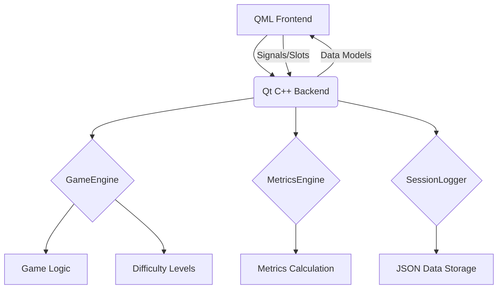

# Ten-Frame Game Architecture Design

## 1. Introduction

This document outlines the architectural design for the Ten-Frame game, a highly graphical and animated educational tool developed using QML for the frontend and Qt C++ for the backend. The game aims to enhance children's understanding of number bonds up to 10 and place value through engaging interactions with physical, colored counters. It will feature different difficulty levels and comprehensive metrics tracking to evaluate learning progress and user engagement.

## 2. Overall Architecture

The game will follow a Model-View-ViewModel (MVVM) pattern, leveraging Qt's capabilities for seamless integration between C++ and QML. The C++ backend will handle game logic, data management, and heavy computation, while the QML frontend will be responsible for the user interface, animations, and visual presentation.



## 3. Qt C++ Backend Components

The C++ backend will consist of several key components:

### 3.1. GameEngine

This component will encapsulate all core game logic, including:

*   **Question Generation:** Generating number bond questions up to 10.
*   **Difficulty Management:** Adjusting question complexity based on selected difficulty levels.
*   **Counter Management:** Handling the state and properties of the physical counters.
*   **Game State Management:** Managing the overall flow of the game (start, pause, end, question progression).
*   **Input Validation:** Validating user input (counter placement).

### 3.2. MetricsEngine

This component will be responsible for calculating and managing various performance metrics:

*   **Raw Data Collection:** Receiving event data from the GameEngine.
*   **Metric Calculation:** Calculating derived metrics such as:
    *   `failed_count`: Number of incorrect attempts for a question.
    *   `correct_count`: Number of correct answers.
    *   `question_asked_relative_time`: Time a question was asked relative to the previous question.
    *   `time_answered`: Time a question was answered relative to when it was asked.
    *   `accuracy`: Percentage of correct answers.
    *   `concentration`: Calculated based on response consistency and time.
    *   `number_sense_index`: An evaluation index reflecting the child's intuitive understanding of numbers.
    *   `mental_math_speed_index`: Rate of response relative to question initiation.
*   **Evaluation Indices:** Providing higher-level evaluation indices.

### 3.3. SessionLogger

This component will handle the logging of all activity events and metrics:

*   **Event Logging:** Recording every significant game event (question asked, counter placed, answer submitted, success/failure) as a JSON object.
*   **JSON Export:** Providing functionality to export the accumulated session data in JSON format.
*   **Data Structure:** Each logged event will include a timestamp, event type, relevant game state, and metric data.

## 4. QML Frontend Components

The QML frontend will provide the visual and interactive elements of the game:

### 4.1. Main Application Window

*   **Game Area:** The primary display for the Ten-Frame board and counters.
*   **Control Panel:** Buttons for starting, pausing, and resetting the game.
*   **Difficulty Selector:** UI elements to choose difficulty levels.
*   **Metrics Display:** Visual representation of real-time metrics (e.g., score, accuracy).

### 4.2. Ten-Frame Board

*   **Grid Layout:** Visual representation of the 10-frame grid.
*   **Counter Slots:** Interactive areas where counters can be placed.

### 4.3. Animated Counters

*   **Graphical Representation:** Highly graphical, colored counters.
*   **Drag-and-Drop Functionality:** Allowing children to interactively place counters.
*   **Animations:** Smooth animations for counter movement, placement, and feedback.

### 4.4. UI Screens

*   **Start Screen:** Game title, play button, instructions.
*   **Game Over Screen:** Summary of performance, option to play again.
*   **Settings Screen:** Options for sound, music, and other game preferences.

## 5. Data Logging and Metrics Details

All activity events will be logged as JSON objects. A sample event structure might look like this:

```json
{
    "timestamp": "2026-05-10T14:30:00Z",
    "event_type": "question_asked",
    "question_id": "q123",
    "question_value": 7,
    "target_bond": 10,
    "difficulty_level": "easy",
    "game_state": {
        "current_score": 0,
        "questions_attempted": 0
    }
}
```

Metrics will be calculated and updated in real-time by the `MetricsEngine` and can be exported as a summary JSON at the end of a session.

## 6. Graphical and Audio Assets

*   **Graphical Assets:** High-resolution images for counters (different colors), backgrounds, UI elements, and animations. Emphasis on sharp, beautiful colors suitable for children.
*   **Audio Assets:** Engaging sound effects for interactions (counter placement, correct/incorrect answers) and background music.

## 7. Integration (C++ and QML)

*   **QML Context Properties:** Exposing C++ objects (GameEngine, MetricsEngine, SessionLogger) to QML as context properties.
*   **Signals and Slots:** Using Qt's signal/slot mechanism for communication between QML UI events and C++ backend logic, and for C++ to update QML UI.
*   **Data Models:** Using `QAbstractListModel` or `QAbstractTableModel` for dynamic lists of counters or other game elements to be displayed in QML.

## 8. Development Workflow

1.  **Phase 1: Design Architecture (Current)**
2.  **Phase 2: Asset Generation:** Create or source all graphical and audio assets.
3.  **Phase 3: C++ Backend Development:** Implement `GameEngine`, `MetricsEngine`, and `SessionLogger`.
4.  **Phase 4: QML Frontend Development:** Design and implement the UI and animations.
5.  **Phase 5: Integration:** Connect C++ backend with QML frontend.
6.  **Phase 6: Packaging and Documentation:** Prepare the final project for deployment.
7.  **Phase 7: Delivery:** Provide the game and documentation to the user.
